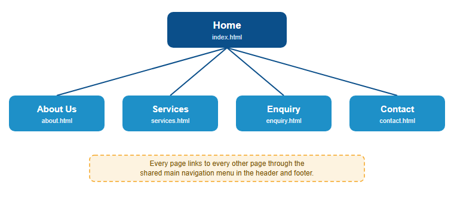
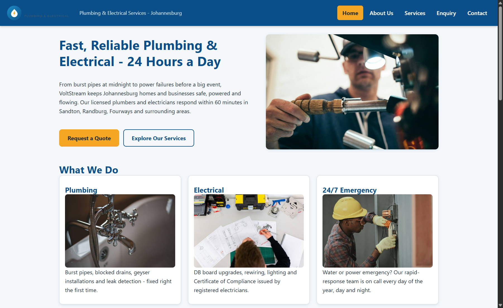
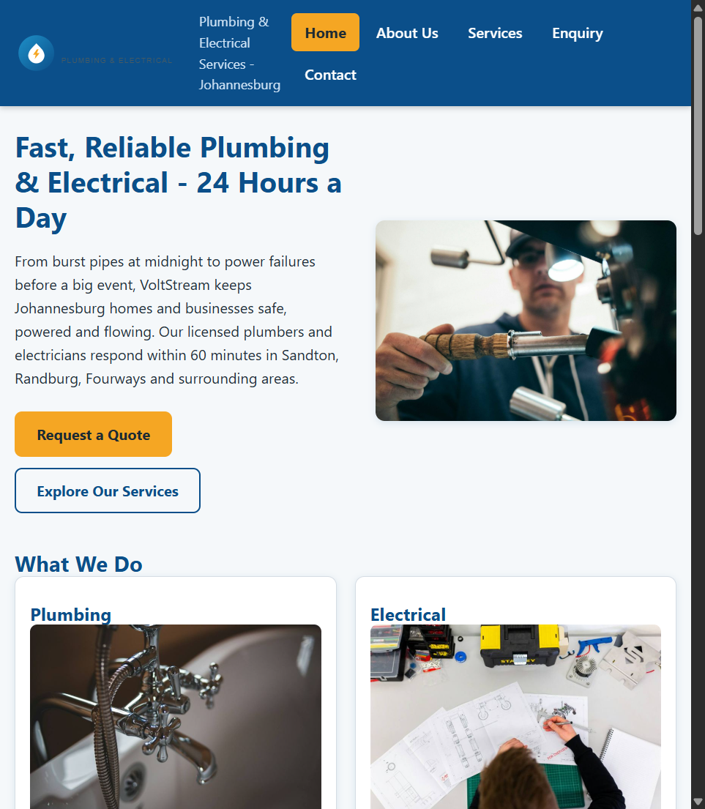
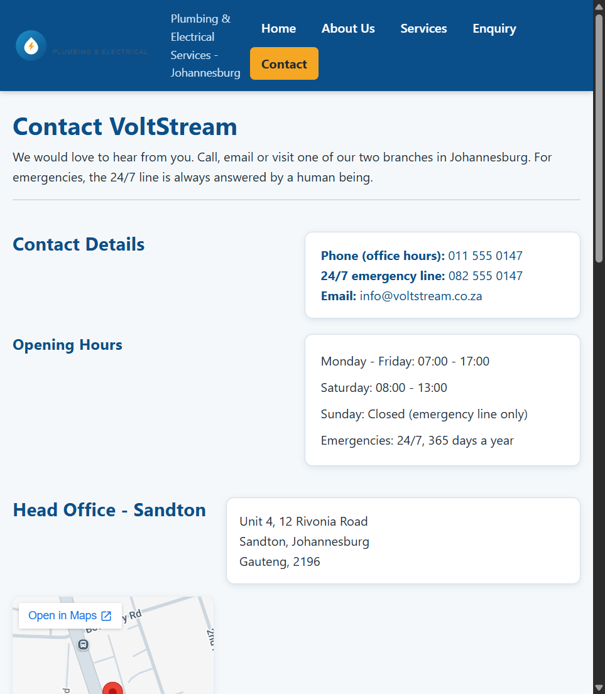
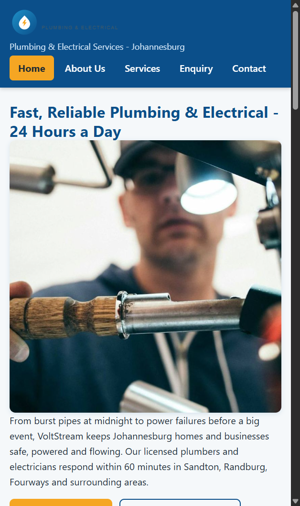
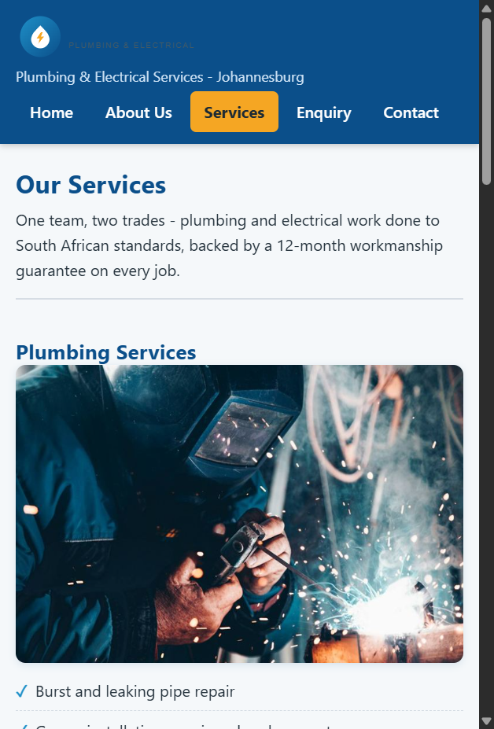
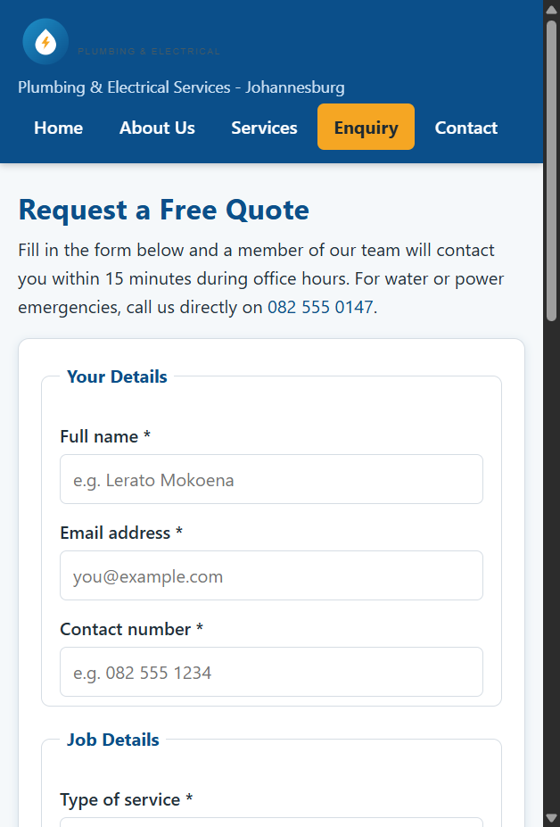
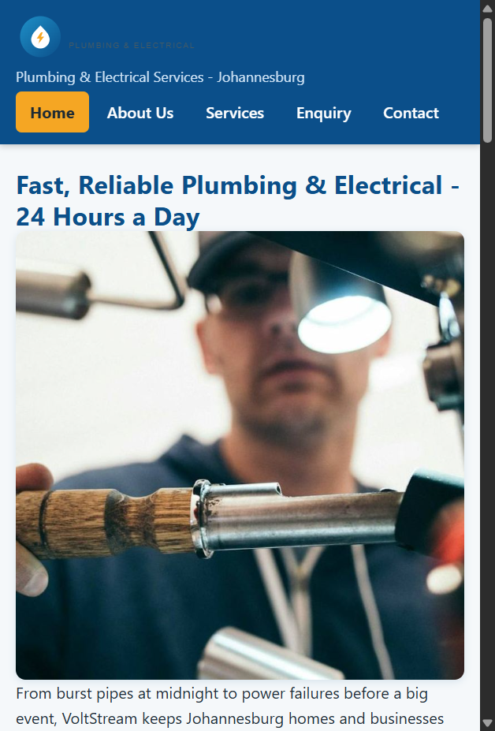

VoltStream Plumbing and Electrical - Company Website

WEDE5020 - Web Development (Introduction) - Portfolio of Evidence

Student Information

Full name: Basim Ubaid Akhtar
Student number: ST10516576
Institution: The Independent Institute of Education (IIE)

GitHub Repository

Link: https://github.com/basimakhtar/WEDE5020-PoE

This repository is on a personal GitHub account because the school's repository invitation link had expired and could not be used.

Project Overview

This project is a multi-page website for VoltStream Plumbing and Electrical (Pty) Ltd, a small plumbing and electrical business in Johannesburg. Two proposals were written, one for VoltStream and one for Paws of Hope Animal Shelter, and VoltStream was chosen as the organisation to build for.

Part 1: the planning, the research and the HTML structure of the site.
Part 2 (this submission): the CSS styling and responsive design.
Part 3: the JavaScript functionality and SEO optimisation.

Website Goals and Objectives

- 20 or more quote requests a month by month 3.
- 60% of enquiries turning into bookings.
- 10 or more emergency call-outs a month from the website.
- First-page Google results for five local search terms by December 2026.
- Home page bounce rate under 45%.

Key Features and Functionality

- Five linked HTML pages with one shared navigation menu.
- Semantic HTML5 with comments throughout.
- An external stylesheet (css/styles.css) shared by every page.
- A CSS reset, base styles, a typography scale and the brand colours as custom properties.
- Flexbox and grid layouts with a mobile-first, single-column layout that widens on bigger screens (MDN Web Docs, 2026).
- Interactive states on links, buttons, cards and form fields (:hover, :focus, :active).
- Responsive images: srcset and sizes attributes on every photo, and a picture element with a square crop for the hero on phones (MDN Web Docs, 2026).
- SEO groundwork: meta descriptions, page titles and alt text.
- A quote enquiry form and a quick contact form.
- Two branch locations, each with an embedded Google Map.
- Original SVG logo and avatars, web-optimised photos under the Unsplash License.
- Git version control with descriptive commits and a changelog.

Timeline and Milestones

28 August 2026: proposals handed in.
4 September 2026: Part 1 due.
25 September 2026: Part 2 due.
30 October 2026: Part 3 due.
6 November 2026: final website submitted.

Part 1 Details

Folder structure:

index.html, about.html, services.html, enquiry.html, contact.html
css/styles.css - the shared stylesheet
js/main.js - empty until Part 3
images/ - photos, logo and team avatars
docs/ - proposals, wireframes, content inventory and screenshots
Content-Research-Part1.zip - the Part 1 submission package

Sitemap

The visual sitemap below was added after the Part 1 feedback noted that no sitemap was provided.

Text version:

index.html (Home)
    about.html (About Us)
    services.html (Services)
    enquiry.html (Enquiry)
    contact.html (Contact)

Part 2 Details

What was added in this part:

1. External stylesheet

All five pages share one stylesheet, css/styles.css, linked in the head of each page. The file is organised into numbered sections: reset, variables, base styles, header, hero, buttons, cards, split sections, testimonials, CTA banner, team, chips, table, branches, forms and footer.

2. Base styles and CSS reset

The reset at the top of the stylesheet removes browser defaults (box-sizing, margins, list bullets, image gaps) so every browser starts from the same place (MDN Web Docs, 2026). The base styles then set the font family, font size, line height, colours, link colours and heading sizes once on the body and the headings, and everything inherits from there.

3. Typography

Headings use clamp() with rem units, so they scale smoothly between phones and desktops instead of jumping at a breakpoint. letter-spacing and line-height are set on headings for readability.

4. Layout with flexbox and grid

The header uses flexbox to keep the logo, tagline and navigation in a row on larger screens. The hero, service cards, team members and footer use CSS Grid. The hero uses grid-template-areas so the heading, text and buttons sit next to the photo. The cards switch from one column to two and then three columns as the screen gets wider (W3Schools, 2026).

5. Visual styles and interactive states

Cards, forms, tables and maps get borders, background colours, border-radius and box-shadows. Links, buttons, cards and form fields all have :hover, :focus and :active states, and keyboard users get a visible amber :focus-visible outline.

6. Responsive design

The layout is mobile-first: one column by default, then two media queries widen it at 40em (tablet) and 64em (desktop). Font sizes and spacing use rem and em, widths use %, and the media queries use em so the breakpoints follow the user's font size setting (MDN Web Docs, 2026).

7. Responsive images

480px and 768px versions of every photo were generated, plus an 800px square crop of the hero. Every content image now has srcset and sizes, so a phone downloads a 480px photo and a desktop downloads the full 1400px photo. The hero uses a picture element with a media query, so phones get the square crop instead of the wide shot (MDN Web Docs, 2026).

8. Testing

Every page was tested in Chrome DevTools at desktop, tablet and two phone sizes. No layout breaks or horizontal scrolling were found, and the network tab confirmed the correct image size loads at each breakpoint.

Screenshot evidence:

Desktop (1440 x 900):

Tablet (768 x 1024):

Mobile (iPhone 12, 390 x 844):

Mobile (Samsung Galaxy S8, 360 x 740):

Part 1 Feedback Fixes

Two things from the Part 1 feedback were fixed in this part:

1. Sitemap was missing (0/5). A visual sitemap diagram has been added to this README under the Sitemap heading, showing all five pages and how they link together.

2. References needed in-text citations (2/5). In-text citations in the (Author, year) style now appear throughout this README and link to the reference list at the bottom.

Changelog

1 September 2026 - project structure created and the git repository initialised.
1 September 2026 - README, proposals, images and the five HTML pages added.
1 September 2026 - team names and avatars updated, proposals rewritten.
1 September 2026 - VoltStream confirmed as the chosen organisation.
1 September 2026 - the css and js files emptied.
1 September 2026 - README and content inventory simplified.
1 September 2026 - GitHub repository link and note added to the README.
5 October 2026 - added a visual sitemap diagram (docs/sitemap.svg) and in-text citations, after the Part 1 feedback on those two criteria.
5 October 2026 - wrote css/styles.css: CSS reset, base styles, typography scale and the brand colours as custom properties.
5 October 2026 - styled the header, navigation, hero, cards, testimonials, CTA banner, team, table, forms, maps and footer with flexbox and grid, including hover, focus and active states.
5 October 2026 - made the layout responsive with breakpoints at 40em and 64em, relative units (rem, em, %) and a mobile-first single-column layout.
5 October 2026 - generated 480px and 768px versions of every photo plus an 800px square hero crop, and added srcset, sizes and a picture element to the HTML.
5 October 2026 - tested all pages in Chrome DevTools at desktop, tablet and two phone sizes, and added the screenshot evidence to the README.

References

Images

Unsplash. 2026. Eight photographs used under the Unsplash License. Photo pages: photo-1558618666-fcd25c85cd64, photo-1621905251189-08b45d6a269e, photo-1585704032915-c3400ca199e7, photo-1581092160562-40aa08e78837, photo-1600585154340-be6161a56a0c, photo-1581091226825-a6a2a5aee158, photo-1503387762-592deb58ef4e, photo-1504328345606-18bbc8c9d7d1, all on https://unsplash.com. License terms: https://unsplash.com/license (Accessed 1 September 2026). The logo and the team avatars are original work by the student.

Code and techniques

Mozilla Developer Network (MDN) Web Docs. 2026. CSS: Cascading Style Sheets. Available at: https://developer.mozilla.org/en-US/docs/Web/CSS (Accessed 5 October 2026).

Mozilla Developer Network (MDN) Web Docs. 2026. Responsive images. Available at: https://developer.mozilla.org/en-US/docs/Web/HTML/Responsive_images (Accessed 5 October 2026).

Mozilla Developer Network (MDN) Web Docs. 2026. Media queries. Available at: https://developer.mozilla.org/en-US/docs/Web/CSS/CSS_media_queries (Accessed 5 October 2026).

W3Schools. 2026. CSS Tutorial. Available at: https://www.w3schools.com/css/ (Accessed 5 October 2026).

W3Schools. 2026. Responsive Web Design Tutorial. Available at: https://www.w3schools.com/css/css_rwd_intro.asp (Accessed 5 October 2026).

Google. 2026. Google Maps embed help. Available at: https://support.google.com/maps/answer/144361 (Accessed 1 September 2026).

Squoosh. 2026. Image compressor. Available at: https://squoosh.app (Accessed 1 September 2026).

Git. 2026. Git documentation. Available at: https://git-scm.com/doc (Accessed 1 September 2026).
